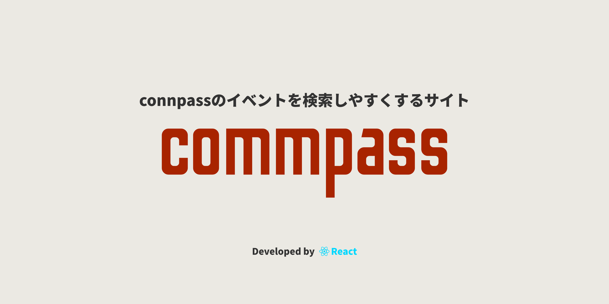

# commpass: connpassのイベントを検索しやすくするサイト

本サイトは「connpass - エンジニアをつなぐIT勉強会支援プラットフォーム」のイベントをより詳細に検索できるようにすることを目的としたサイトです（connpassのAPIを使用しています）。

 
 

## 🌐 アプリURL

### **https://commpass.muck.jp/**

 

## 📦 検索項目一覧

* 都道府県での絞り込み
* 言語・技術での絞り込み
* フレームワークでの絞り込み
* 開催日での絞り込み
* その他フリーキーワードでの絞り込み

 

## 💻 使用技術等

* TypeScript 3.9.6
* React 17.0.4

 

## 🎫 ライセンス

[MIT](LICENSE.txt)
